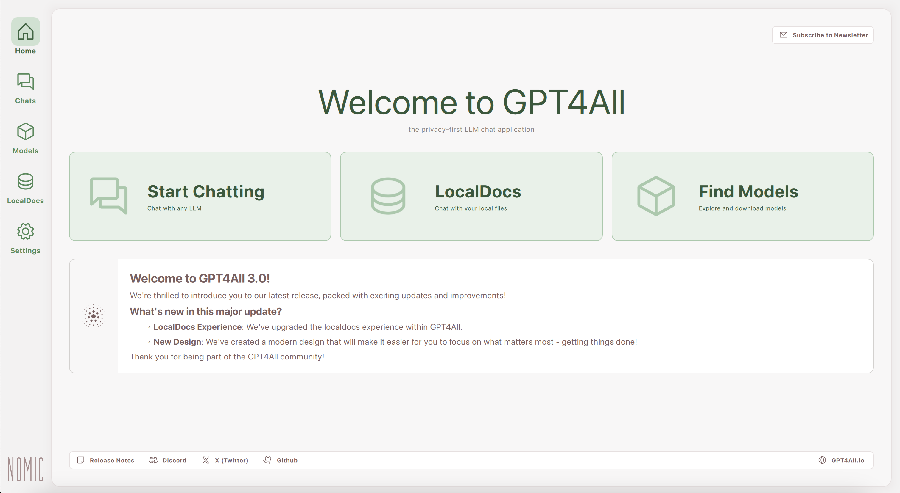
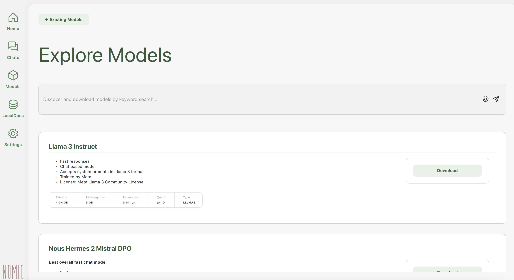
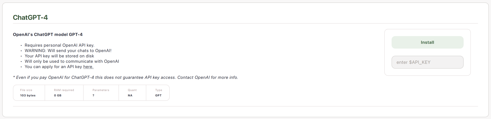

# Explore GPT4All Desktop

The GPT4All Desktop Application allows you to download LLMs to your computer & chat with your documents locally & securely on your device. Please enjoy this tour of the various features and menus in the application. 

Visit our [FAQ](../gpt4all_help/faq.md) or [troubleshooting](../gpt4all_help/troubleshooting.md) pages if you run into any issues with these features.

## Landing Page

The first thing you see when you open GPT4All is our landing page, where you can begin chatting with your model, indexing your local files to prepare for chatting, or browsing models available for download onto your system.

## Find Models

### First Time? Try Llama-3-Instruct

If it's your first time using GPT4All, get started by downloading a model. We recommend Llama 3 Instruct as a solid first choice.

### Search HuggingFace 

You can enter search queries that will

## Start Chatting

Search tool built to auto-load models uploaded to the HuggingFace ecosystem.

## Local Docs